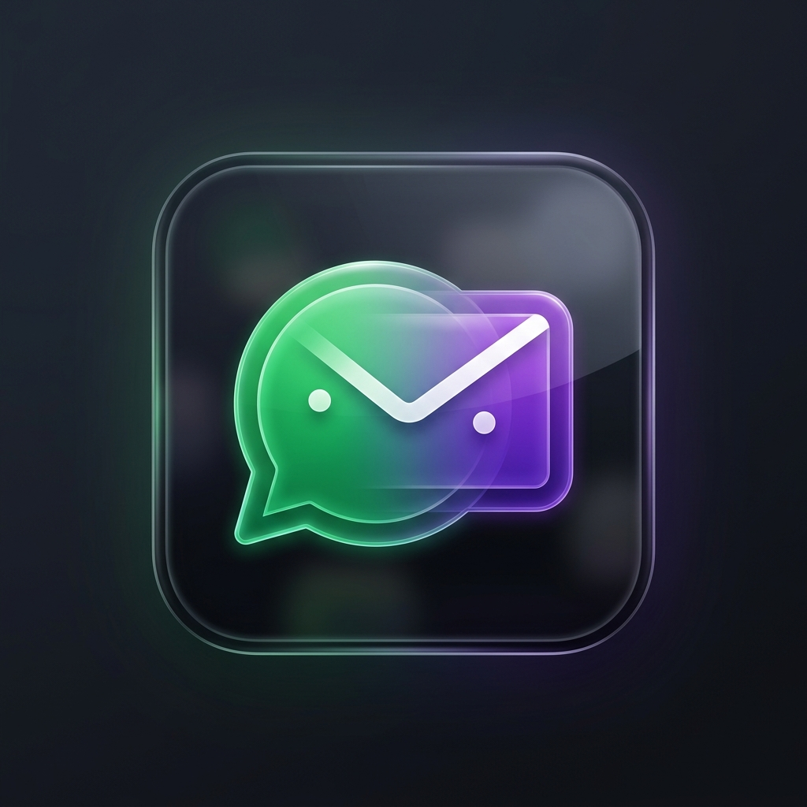

# 📧 Mail2WhatsApp AI ➡️ 💬

<p align="center">
  
</p>

<p align="center">
  <strong>Intelligent Real-Time Email Prioritization, Summarization, and WhatsApp Forwarding Gateway</strong>
</p>

<p align="center">
  <a href="https://whatsapp2mail.duckdns.org"><strong>🚀 Live Production Link</strong></a> | 
</p>

---

## 📖 Project Overview
**Mail2WhatsApp AI** is a self-hosted, lightweight notification gateway designed to solve email overload. It continuously monitors your Gmail inbox, analyzes incoming emails using advanced LLM intelligence, filters out spam, categorizes them, drafts brief summaries of important emails, and forwards them directly to your WhatsApp.

Built with a modern stack including **React, Node.js (TypeScript), SQLite, and Google Gemini**, it runs 24/7 on an AWS EC2 cloud instance under Caddy reverse-proxy and PM2.

---

## ✨ Key Features
- 🔄 **Real-Time Gmail Poll Daemon:** Run as a continuous background service looking for new unread mail headers and bodies.
- 🧠 **AI Priority Triage:** Integrates native `@google/genai` (specifically `gemini-2.5-flash`) to analyze and prioritize (High/Medium/Low) and classify (Work, Personal, System) emails.
- 📝 **Intelligent Summarization:** Creates concise summaries of long emails so you can read them at a glance on the road.
- 💬 **Flexible WhatsApp Dispatcher:** Integrates with Meta's Graph API. Supports both **Free-Form Text Messages** (24h session window) and **Template Messages** (bypasses 24h window).
- 🔐 **Secure Design:** Self-hosted database (SQLite), session tokens protected with high-entropy JWT secrets, and no third-party data tracking.
- 🛡️ **Auto HTTPS/SSL:** Built-in Caddy configuration for automatic SSL certificate provisioning.

---

## 🛠️ Technology Stack
- **Frontend:** React, Lucide Icons, Vite, Tailwind CSS (modern premium dark-mode dashboard).
- **Backend:** Node.js, Express, TypeScript.
- **Database:** SQLite (local cache for performance & absolute privacy).
- **AI Core:** Google Gemini SDK (`@google/genai`).
- **Hosting & Infrastructure:** AWS EC2 (t3.micro), Caddy Server (reverse proxy & SSL), PM2 (node process manager).
- **DNS wildcards:** DuckDNS wildcard mapping.

---

## 🔑 Environment Variables Configuration
Create a `.env` file in the root directory:

```env
# LLM Provider Configuration
LLM_PROVIDER=google
LLM_API_KEY=your_gemini_api_key
LLM_MODEL=gemini-2.5-flash

# Google OAuth 2.0 Credentials (Gmail API)
GOOGLE_CLIENT_ID=your_google_client_id.apps.googleusercontent.com
GOOGLE_CLIENT_SECRET=your_google_client_secret
GOOGLE_REDIRECT_URI=https://whatsapp2mail.duckdns.org/api/auth/google/callback

# JWT Security
JWT_SECRET=your_secure_64_character_hex_signing_secret

# WhatsApp Cloud API Credentials
WHATSAPP_ACCESS_TOKEN=your_meta_system_user_permanent_access_token
WHATSAPP_PHONE_NUMBER_ID=your_meta_phone_number_id

# (Optional) WhatsApp Template settings to bypass 24h window
WHATSAPP_TEMPLATE_NAME=email_alert
WHATSAPP_TEMPLATE_LANG=en
```

---

## 🚀 Step-by-Step Setup Guide

### 1. Google OAuth Client Configuration
1. Go to the [Google Cloud Console](https://console.cloud.google.com/).
2. Enable the **Gmail API** (*APIs & Services > Library*).
3. Set up the OAuth Consent Screen:
   - User Type: **External**.
   - Add scopes: `openid`, `.../auth/userinfo.email`, `.../auth/userinfo.profile`, and `https://www.googleapis.com/auth/gmail.readonly`.
   - Add your Gmail as a **Test User** (mandatory while app is in testing).
4. Create **OAuth Client ID Credentials** (Web Application):
   - **Authorized Redirect URIs:** Add `https://whatsapp2mail.duckdns.org/api/auth/google/callback` (production) and `http://localhost:3000/api/auth/google/callback` (local dev).
5. Copy the Client ID and Secret to `.env`.

---

### 2. DuckDNS Wildcard Mapping Setup
Google OAuth Console blocks raw IP addresses. To use a free custom domain:
1. Log in to [DuckDNS](https://www.duckdns.org/).
2. Add a new domain named `whatsapp2mail` (yielding `whatsapp2mail.duckdns.org`).
3. Set the IP address of `whatsapp2mail` to your EC2 instance Public IP (`54.162.62.35`).

---

### 3. Meta WhatsApp Cloud API Setup (Live Mode)
To register your own number and get rid of sandbox test-number limitations:
1. Go to the [Meta Developers Console](https://developers.facebook.com/).
2. Add the **WhatsApp** product to your Business App.
3. Switch App status from **In Development** to **Live** (requires linking a payment method, but the first 1,000 conversations every month are 100% free!).
4. Add a permanent sender phone number in the *WhatsApp > API Setup* tab.
5. Create a **System User** in Meta Business Manager and generate a **Permanent Access Token** with `whatsapp_business_messaging` scope.
6. **(To bypass the 24-hour session window restriction):**
   - Go to *Message Templates* in the WhatsApp manager and create a template named `email_alert`:
     ```text
     📧 New Urgent Email Alert
     
     From: {{1}}
     Subject: {{2}}
     Category: {{3}}
     Urgency: {{4}}
     
     Gemini/LLM Summary:
     {{5}}
     ```
   - Once approved, add `WHATSAPP_TEMPLATE_NAME=email_alert` to your `.env` file on the server.

---

### 4. Deploying to AWS EC2 (Production Setup)
1. **Launch Instance:**
   - Launch a `t3.micro` EC2 Instance using **Ubuntu 24.04 LTS**.
   - Associate a security group opening ports `22` (SSH), `80` (HTTP), and `443` (HTTPS).
2. **Install Server Packages:**
   ```bash
   sudo apt-get update -y
   sudo apt-get install -y curl git caddy
   curl -fsSL https://deb.nodesource.com/setup_20.x | sudo -E bash -
   sudo apt-get install -y nodejs
   sudo npm install -g pm2
   ```
3. **Upload Files & Configure:**
   - SCP project code and your customized `.env` to `/home/ubuntu/mail2whatsapp-ai/`.
   - Run `npm install` and `npm run build` in the directory.
4. **Launch Application:**
   ```bash
   NODE_ENV=production pm2 start "npx tsx server.ts" --name "mail2whatsapp" --cwd "/home/ubuntu/mail2whatsapp-ai"
   pm2 save
   pm2 startup
   ```
5. **Caddy Reverse Proxy Setup:**
   Configure `/etc/caddy/Caddyfile`:
   ```caddy
   whatsapp2mail.duckdns.org {
       reverse_proxy localhost:3000
   }
   ```
   Restart Caddy: `sudo systemctl restart caddy`. Caddy will automatically secure your domain with Let's Encrypt HTTPS certificates!

---

### 💻 Local Development
1. Install dependencies: `npm install`
2. Run in dev mode: `npm run dev`
3. Open browser: `http://localhost:3000`

---

## 📜 Privacy & Security
This application is self-hosted. All fetched emails are processed in-memory and details are stored locally inside `database.db`. No data is ever transmitted to any third-party analytics company.
