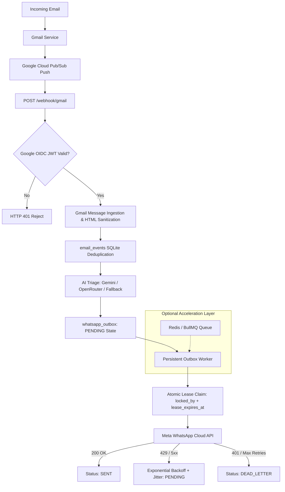

# 📧 Mail2WhatsApp AI ➡️ 💬

> **Production-hardened and ready for controlled 30+ day soak testing.**

Intelligent, real-time Gmail inbox prioritization, LLM analysis, and resilient Meta WhatsApp Cloud dispatch gateway.

---

## 1. Overview
**Mail2WhatsApp AI** is an enterprise-grade notification gateway designed to eliminate email overload. It continuously monitors your Gmail inbox via real-time Google Cloud Pub/Sub push notifications, analyzes incoming messages using Google Gemini AI (with heuristic rule fallbacks), and delivers concise, actionable notifications directly to your WhatsApp.

---

## 2. Architecture & Reliability Hierarchy


```mermaid
flowchart TD
    A[Incoming Email] --> B[Gmail Service]
    B --> C[Google Cloud Pub/Sub Push]
    C --> D[POST /webhook/gmail]
    D --> E{Google OIDC JWT Valid?}
    E -- No --> F[HTTP 401 Reject]
    E -- Yes --> G[Gmail Message Ingestion & HTML Sanitization]
    G --> H[email_events SQLite Deduplication]
    H --> I[AI Triage: Gemini / OpenRouter / Fallback]
    I --> J[whatsapp_outbox: PENDING State]
    J --> K[Persistent Outbox Worker]
    K --> L[Atomic Lease Claim: locked_by + lease_expires_at]
    L --> M[Meta WhatsApp Cloud API]
    M -- 200 OK --> N[Status: SENT]
    M -- 429 / 5xx --> O[Exponential Backoff + Jitter: PENDING]
    M -- 401 / Max Retries --> P[Status: DEAD_LETTER]
    
    subgraph Optional Acceleration Layer
        Q[Redis / BullMQ Queue] -.-> K
    end
```

> **Authoritative Durability Guarantee**: SQLite (`email_events` + `whatsapp_outbox` in WAL mode) is the primary, durable source of truth guaranteeing at-least-once delivery and zero data loss. Redis & BullMQ act as an optional acceleration and distribution layer that gracefully falls back to the native SQLite outbox when Redis is not running.

---

## 3. Features
- ⚡ **Real-Time Push Ingestion**: Sub-second webhook triggers from Google Cloud Pub/Sub.
- 🛡️ **Cryptographic OIDC Security**: Validates Google JWKS signatures, issuer, audience, and GCP service accounts.
- 🧠 **Multi-Tier AI Prioritization**: Primary Google Gemini 2.5 Flash with automatic OpenRouter and heuristic regex fallbacks.
- 📬 **Durable WhatsApp Outbox**: Atomic lease claiming, zero synchronous HTTP delays in ingestion paths, and dead-letter queues.
- 🔐 **Authenticated AES-256-GCM Encryption**: OAuth tokens and credentials encrypted at rest with zero log leakage.
- 📊 **Prometheus Metrics**: Live `/metrics` exposition and health checks (`/health/live`, `/health/ready`).

---

## 4. Tech Stack
- **Backend**: Node.js (v20+ LTS), Express, TypeScript.
- **Frontend**: React 18, Vite, Tailwind CSS, Lucide Icons.
- **Database**: SQLite 3 (WAL mode, busy_timeout=5000) via `better-sqlite3`.
- **AI Engine**: Google Gemini (`@google/genai`), OpenRouter.
- **Messaging**: Meta WhatsApp Cloud API (Graph API v20.0).
- **Observability**: Prometheus text format, Pino structured JSON logging.

---

## 5. Repository Structure
```text
Mail2Whatsapp-Ai/
├── src/
│   ├── app/                # Express bootstrap, routes, shutdown handlers
│   ├── config/             # Zod environment schemas and application constants
│   ├── database/           # SQLite connection, DDL schema, migrations
│   ├── services/
│   │   ├── gmail/          # Gmail OAuth & API communication
│   │   ├── whatsapp/       # WhatsApp alert builder & persistent outbox worker
│   │   ├── ai/             # Gemini SDK triage, OpenRouter & fallback classifiers
│   │   ├── pubsub/         # Google OIDC JWT verification
│   │   ├── queue/          # BullMQ & Redis orchestration
│   │   └── metrics/        # Prometheus exposition metrics
│   ├── middleware/         # Auth, sliding-window rate limiting, request tracing
│   ├── utils/              # Authenticated AES-256-GCM, phone & HTML sanitizers
│   └── types/              # Domain interfaces
├── tests/
│   ├── unit/               # Fast component & unit test suites
│   ├── integration/        # Database constraint & concurrency tests
│   └── reliability/        # Soak tests, failure injection, backup drills
├── docs/                   # Authoritative architecture, operations, and security docs
├── Dockerfile              # Minimal multi-stage production Docker image
├── docker-compose.yml      # Local containerized deployment
└── docker-compose.production.yml
```

---

## 6. Local Development
```bash
# 1. Install dependencies
npm install

# 2. Run local development server
npm run dev

# 3. Access dashboard
open http://localhost:3000
```

---

## 7. Environment Variables
Copy `.env.example` to `.env`:
```env
PORT=3000
NODE_ENV=production
DATABASE_PATH=mail2whatsapp.db
JWT_SECRET=your_secure_64_character_hex_signing_secret
DB_ENCRYPTION_KEY=your_secure_64_character_hex_encryption_key

# Google Gemini / LLM Triage Configuration
LLM_PROVIDER=google
LLM_API_KEY=your_gemini_api_key
LLM_MODEL=gemini-2.5-flash

# Google Cloud OAuth 2.0 Credentials
GOOGLE_CLIENT_ID=your_client_id.apps.googleusercontent.com
GOOGLE_CLIENT_SECRET=your_client_secret
GOOGLE_REDIRECT_URI=https://whatsapp2mail.duckdns.org/api/auth/google/callback

# WhatsApp Meta Cloud API
WHATSAPP_ACCESS_TOKEN=your_meta_system_user_token
WHATSAPP_PHONE_NUMBER_ID=your_meta_phone_number_id

# Google Cloud Pub/Sub Webhook Security
PUBSUB_AUDIENCE=https://whatsapp2mail.duckdns.org/webhook/gmail
PUBSUB_SERVICE_ACCOUNT=your-pubsub-service-account@your-gcp-project.iam.gserviceaccount.com
```

---

## 8. Testing
```bash
# Run 55 tests across all 13 suites
npm test

# Typecheck & Lint
npm run lint

# Production Build
npm run build
```

---

## 9. Production Deployment
```bash
# PM2 Startup
pm2 start "npm start" --name "mail2whatsapp"
pm2 save
pm2 startup
```

---

## 10. Monitoring
- **Liveness Probe**: `GET /health/live`
- **Readiness Probe**: `GET /health/ready`
- **Dependency Diagnostics**: `GET /health/dependencies`
- **Prometheus Metrics**: `GET /metrics`

---

## 11. Disaster Recovery
- Live atomic SQLite backup: `sqlite3 mail2whatsapp.db ".backup 'mail2whatsapp_backup.db'"`
- Integrity validation: `sqlite3 mail2whatsapp.db "PRAGMA integrity_check;"`

---

## 12. Security
- Pure Google OIDC JWT verification via `google-auth-library` (`OAuth2Client.verifyIdToken()`).
- Authenticated AES-256-GCM token encryption with HMAC tampering detection.
- Meta webhook HMAC-SHA256 signature verification.

---

## 13. Reliability Guarantees
- **Durable At-Least-Once Delivery**: Events committed before acknowledge.
- **Database Idempotency**: Unique constraints on message identifiers.
- **Atomic Worker Leases**: Leases prevent concurrent worker dispatch collision.

---

## 14. License
MIT License.
