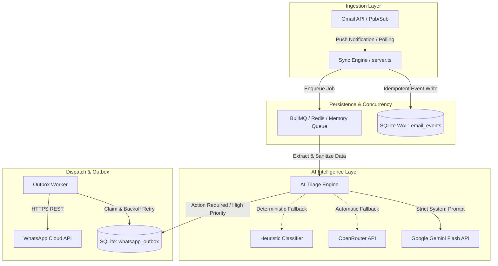

# Mail2WhatsApp AI — Enterprise System Architecture

## 1. System Overview & Topology

Mail2WhatsApp AI is an autonomous, production-grade notification and triage gateway designed for 24/7 unattended operation with high availability and resilience.

## 2. Core Reliability Guarantees

### 2.1 Database Concurrency (SQLite WAL Mode)
- **WAL Mode (`PRAGMA journal_mode = WAL;`)**: Allows concurrent reads without blocking writes.
- **Busy Timeout (`PRAGMA busy_timeout = 5000;`)**: Prevents `SQLITE_BUSY` contention errors.
- **Normal Synchronous (`PRAGMA synchronous = NORMAL;`)**: Optimal balance between persistence durability and I/O performance.

### 2.2 End-to-End Idempotency
- **Ingestion Deduplication**: Deterministic compound key `gmail:{gmailAccountId}:{gmailMessageId}` in `email_events`.
- **Dispatch Deduplication**: Deterministic key `whatsapp:{userId}:{emailEventId}:{messageType}` in `whatsapp_outbox`.

### 2.3 Persistent Outbox State Machine
| State | Transition Trigger | Action |
|---|---|---|
| `PENDING` | Created or retry scheduled | Waiting for worker claim |
| `PROCESSING` | Worker claim lock | Locked for dispatch attempt |
| `SENT` | WhatsApp HTTP 200 OK | Finished successfully |
| `FAILED` | Transient network error | Increments attempt count, applies exponential backoff + jitter, returns to `PENDING` |
| `DEAD_LETTER` | 7 failed attempts or 4xx permanent error | Moved to DLQ, alerts logged |
