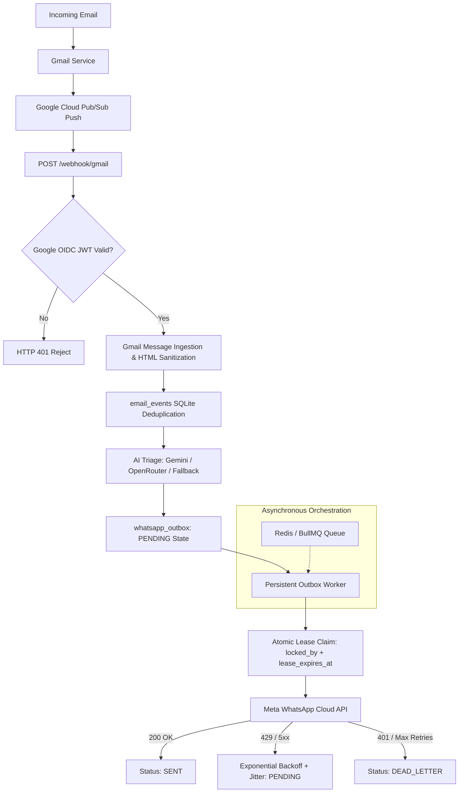

# Mail2WhatsApp AI — Architecture Overview

## 1. System Overview
Mail2WhatsApp AI is an enterprise-grade notification gateway designed to ingest incoming emails from Gmail in real time, analyze and prioritize them using large language models (LLMs) with heuristic safety fallbacks, and reliably dispatch actionable notifications via the Meta WhatsApp Cloud API.

The system is architected for 30+ days continuous, unattended operation, surviving crashes, restarts, duplicate Gmail notifications, rate limits, and network partitions.

## 2. Core Architecture & Pipeline

## 3. Data Flow
1. **Pub/Sub Notification**: Google Cloud Pub/Sub sends an HTTPS POST webhook containing `Authorization: Bearer <Google-signed OIDC JWT>`.
2. **Cryptographic Authentication**: The webhook endpoint verifies the token signature against Google's public JWKS certificates, ensuring valid issuer (`accounts.google.com`), `PUBSUB_AUDIENCE`, and `PUBSUB_SERVICE_ACCOUNT`.
3. **Gmail Ingestion**: Email payload is fetched from Gmail API, and raw HTML is sanitized to clean plaintext.
4. **Database Event Commit**: Record is inserted into `email_events` with `UNIQUE(gmail_account_id, gmail_message_id)`.
5. **AI Prioritization**: Content is enclosed inside `<untrusted_email_data>` XML containment boundaries and processed by Gemini Flash (or OpenRouter/Heuristic fallback) adhering to strict Zod schemas.
6. **Durable Outbox**: Actionable alerts are enqueued to `whatsapp_outbox` with status `PENDING` and a deterministic `idempotency_key`.
7. **Decoupled Worker Dispatch**: The background outbox worker atomically leases rows, dispatches outside DB transactions, and handles jittered exponential backoffs.

## 4. Single Source of Truth
The authoritative store for WhatsApp message delivery is the persistent SQLite `whatsapp_outbox` table in WAL mode. Redis/BullMQ acts strictly as an optional asynchronous orchestration accelerator.
